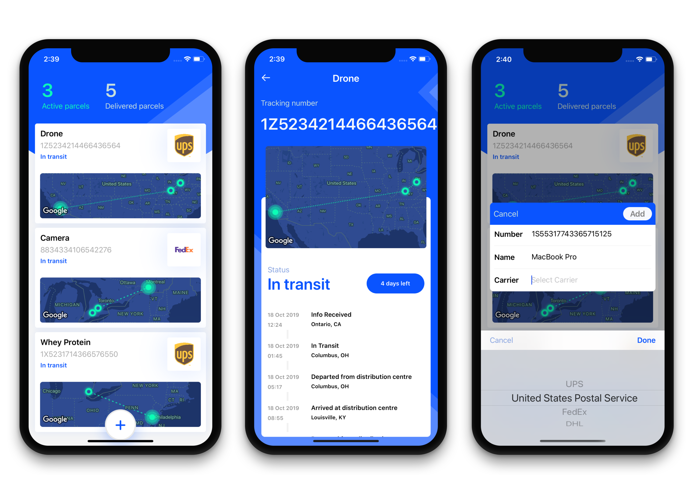

# PackTrack

> Keep track of all your parcels in one beautiful app.

## Requirements
- XCode11
- npm
- Cocoapods

## Usage
`git clone https://github.com/markmansur/PackTrack.git`

> you can now install dependencies.

`cd PackTrack/server`

`npm install`

`cd ../iOS`

`pod install`

Next you'll need to sign up for an Google Maps Api key. Once you have your key, edit the default XCode scheme and add an environment variable under the run tab. the key is 'GOOGLE_API_KEY' and the value is your api key.

To setup the backend you need a api key from Aftership. Create a `.env` file in the server folder. you can use the example file provided to see the structure of your `.env` file. set your api key to the value `AFTERSHIP_KEY`

from the `server` folder run `npm run dev` this will start the server on port `5000`

You're ready to build and run the  iOS app.

## Author
This work is authored by Mark Mansur

## License
PackTrack is open-sourced under [MIT-License](https://opensource.org/licenses/MIT).
